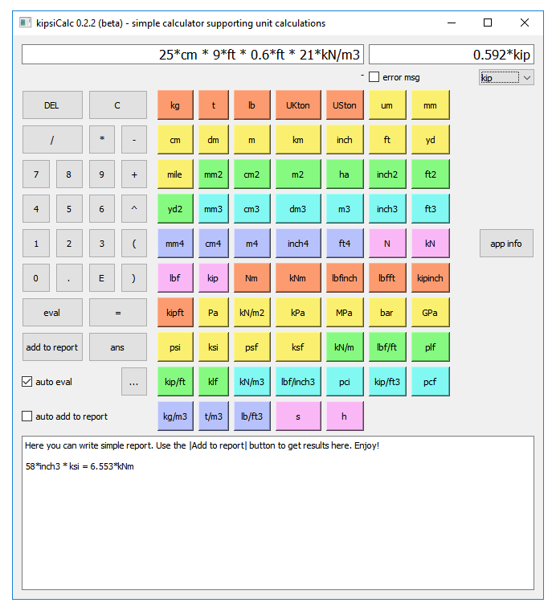

kipsiCalc - Simple calculator supporting unit calculations
----------------------------------------------------------

`Download for Windows <https://github.com/lukaszlaba/kipsiCalc/releases>`_

Changelog
---------

kipsiCalc 0.2.4 (beta stage for testing)
  - clipboard input and output
  - kcf unit added

kipsiCalc 0.2.3 (beta stage for testing)
  - add to report in new line fixed
  - imperial length result as sum of feet and inch (2ft + 3inch)
  - app wep page open when app info button pushed

kipsiCalc 0.2.2 (beta stage for testing)
  - editing expression in place where cursor is
  - inserting result to report where cursor is
  - pci unit added - subgrade modulus same as lbf/inch3
  - pcf unit added - subgrade modulus same as lbf/ft3
  - klf unit added - force per length same as kip/ft
  - UKton unit added - UK long ton
  - USton unit added - US short ton
  - gn constant added - standard gravity

kipsiCalc 0.2.1 (beta stage for testing)
  - first public release

Description
-----------

kipsiCalc make possible to calculate an expression that contain units. Most metric and imperial units are available. So for example you can just calculate expression like that (bending moment for a beam) ::

    12*kN/m * (5.6*ft)^2 / 8 = 3.223*kipft

Requirements
------------
kipsiCalc is based on Python 3 and few non-standard Python library:

  - PyQt4 (https://www.riverbankcomputing.com/software/pyqt) - user interface
  - Unum (https://pypi.python.org/pypi/Unum) - it is what make unit calculation possible

How to run it
-------------

After the Python and needed library was installed, just run kipsCalc.py file.

There is also windows binaries available. Just download it and run exe file.
Please find link to windows binaries download below.

https://github.com/lukaszlaba/kipsiCalc/releases

License
-------

Copyright (C) 2019-2020 Łukasz Laba <lukaszlaba@gmail.pl>

ksipsiCalc is free software; you can redistribute it and/or modify
it under the terms of the GNU General Public License as published by
the Free Software Foundation; either version 2 of the License, or
(at your option) any later version.

ksipsiCalc is distributed in the hope that it will be useful,
but WITHOUT ANY WARRANTY; without even the implied warranty of
MERCHANTABILITY or FITNESS FOR A PARTICULAR PURPOSE.  See the
GNU General Public License for more details.

You should have received a copy of the GNU General Public License
along with ksipsiCalc; if not, write to the Free Software
Foundation, Inc., 51 Franklin St, Fifth Floor, Boston, MA  02110-1301  USA

Contributions
-------------

If you want to help out, create a pull request. You can also contact by email.

More information
----------------

Project website: https://github.com/lukaszlaba/kipsiCalc

Code repository: https://github.com/lukaszlaba/kipsiCalc

Windows binaries download: https://github.com/lukaszlaba/kipsiCalc/releases

Contact: Łukasz Laba <lukaszlaba@gmail.pl>
